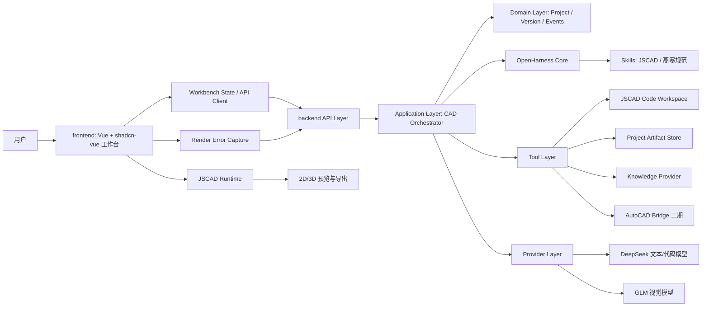

# 架构设计

## 工程结构

高寒智建当前采用三层工程结构：

```text
ArcticCAD-Agent/
  frontend/    # Vue3 + Vite + shadcn-vue 工作台
  backend/     # OpenHarness 改造后的 CAD Agent 后端
  docs/        # 项目文档
```

`frontend/` 与 `backend/` 通过 API 和事件协议通信。OpenHarness 只作为 `backend/` 内部 harness 基座，不作为前端依赖，也不直接暴露内部包路径给业务接口。

## 系统分层



## 后端分层

- API layer：HTTP、SSE、WebSocket、DTO、鉴权和错误响应。
- Application layer：CAD Orchestrator、任务编排、用例服务、修复循环。
- Domain layer：Project、CodeVersion、AgentEvent、ReviewReport、JscadRunResult 等核心模型。
- Tool layer：JSCAD 写入、审图、导出、截图、AutoCAD 桥接工具。
- Provider layer：DeepSeek、GLM、Knowledge、Storage、CAD Export adapter。

## 依赖方向

- UI -> frontend services -> API contracts -> backend API。
- backend application -> domain interfaces。
- infrastructure adapters -> domain interfaces。
- OpenHarness core -> backend application adapter。
- 前端不能直接依赖 OpenHarness 内部模块。
- 业务用例不能直接写死 DeepSeek、GLM、文件系统、知识库或 AutoCAD COM。

## 接口边界

- `AgentGateway`：前端发送聊天、改图、审图请求，并接收 Agent 事件流。
- `ProjectRepository`：项目、代码版本、运行产物存储。
- `ModelRouter`：DeepSeek/GLM 路由。
- `SkillProvider`：JSCAD skill 与高寒规范 skill 加载。
- `RenderResultReceiver`：接收前端 JSCAD 运行结果和错误。
- `ExportService`：SVG/STL/DXF 与后续 DWG/AutoCAD 导出。

## 前端工作区

- 左侧：项目、版本、导出和资源导航。
- 中间：JSCAD 2D/3D 画布，是主工作区。
- 右侧：代码编辑器、参数面板、审图结果和项目信息 Tabs。
- 底部或右下抽屉：AI 对话、事件流、工具调用日志和错误修复记录。

AI 对话区必须明确展示当前状态，包括思考、加载 skill、调用工具、写入代码、渲染、报错、修复、完成等过程。

## 代码生成修复链路

```text
用户需求
  -> frontend API client
  -> backend API layer
  -> CAD Orchestrator
  -> 加载 JSCAD skill 和项目上下文
  -> DeepSeek 生成 JSCAD
  -> 写入 main.js / 新版本
  -> 前端执行渲染
  -> 成功：展示图纸并归档
  -> 失败：截获错误并回传 JscadRunResult
  -> DeepSeek 修复代码
  -> 重新写入和渲染
```

## TypeScript 接口约束

```ts
interface AgentGateway {
  sendMessage(input: ChatRequest): AsyncIterable<AgentEvent>
  submitRenderResult(result: JscadRunResult): Promise<void>
  requestReview(input: ReviewRequest): AsyncIterable<AgentEvent>
}

interface ChatRequest {
  projectId: string
  message: string
  currentVersionId?: string
  viewportSnapshotId?: string
}

interface ReviewRequest {
  projectId: string
  versionId: string
  snapshotId?: string
  userRequirement?: string
}
```

## Python 后端接口约束

```python
class ModelRouter(Protocol):
    async def complete_code(self, prompt: str, context: dict) -> str: ...
    async def review_image(self, prompt: str, image: bytes) -> ReviewReport: ...

class ProjectRepository(Protocol):
    async def save_code_version(self, project_id: str, code: str, summary: str) -> str: ...
    async def get_project_context(self, project_id: str) -> dict: ...

class SkillProvider(Protocol):
    async def load_skill(self, name: str) -> str: ...
```

## Agent 事件协议

```ts
type AgentEvent =
  | { type: 'thinking'; message: string }
  | { type: 'skill_loading'; skill: string; status: 'start' | 'done' | 'error' }
  | { type: 'tool_start'; tool: string; inputSummary: string }
  | { type: 'tool_progress'; tool: string; progress: number; message: string }
  | { type: 'tool_result'; tool: string; ok: boolean; resultSummary: string }
  | { type: 'code_patch'; language: 'jscad'; code: string; summary: string }
  | { type: 'code_write_start'; target: string }
  | { type: 'code_write_done'; target: string; versionId: string }
  | { type: 'render_request'; reason: string }
  | { type: 'render_error'; errorKind: string; message: string; stack?: string }
  | { type: 'repair_start'; reason: string }
  | { type: 'repair_done'; versionId: string; summary: string }
  | { type: 'vision_review'; provider: 'glm'; report: ReviewReport }
  | { type: 'done'; summary: string }
  | { type: 'error'; message: string; recoverable: boolean }
```

## JSCAD 运行结果

```ts
interface JscadRunResult {
  ok: boolean
  versionId: string
  geometrySummary?: string
  error?: {
    kind: 'syntax' | 'api' | 'geometry' | 'render' | 'export'
    message: string
    stack?: string
    line?: number
    column?: number
  }
}
```

错误类型定义：

- `syntax`：语法错误或模块格式错误。
- `api`：调用不存在或不兼容的 JSCAD API。
- `geometry`：`main()` 未返回合法 geometry 或 geometry 数组。
- `render`：渲染器初始化或绘制失败。
- `export`：导出 SVG/STL/DXF 失败。

## 审图报告结构

```ts
interface ReviewReport {
  summary: string
  risks: Array<{
    level: 'low' | 'medium' | 'high'
    category: string
    description: string
    suggestion: string
  }>
  drawingUnderstanding: string
  coldRegionNotes: string[]
  recommendAutoFix: boolean
}
```

## 项目文件结构

```text
projects/<project_id>/
  main.js
  metadata.json
  versions/
  snapshots/
  reviews/
  exports/
  runs/
```

## 安全边界

- JSCAD 代码优先在浏览器沙箱中执行。
- 后端 MVP 不直接执行用户 CAD 代码。
- API key 只保存在后端环境变量中。
- AutoCAD COM 能力默认关闭，二期通过显式配置启用。
- 智能体只能写入项目工作区内的受控文件。
